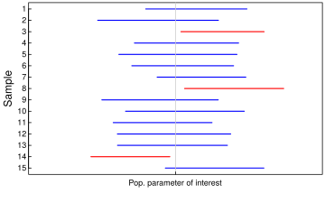

```{r global options, include = FALSE}
knitr::opts_chunk$set(echo=TRUE, warning=FALSE, message=FALSE)

library(tidyverse)
```

# Introduction

Hello, and welcome to my blog! Today, I am excited to explore the concept of coverage probability with you. I am hopeful that through reading this blog, you will see how useful skills like mine will be for your company. Enjoy!

**Coverage probability** is an important operating characteristic of methods
for constructing interval estimates (for example: confidence intervals).

**Definition:** For the purposes of this blog, I will define the _95%
confidence interval of the median_ to be the middle 95% of sampling
distribution of the median. Similarly, the 95% confidence interval of
the mean, standard deviation, etc. is the middle 95% of the respective
sampling distribution.

**Definition:** For the purposes of this blog, I will define the
_coverage probability_ as the long run proportion of intervals that
capture the population parameter of interest. 

**Conceptually, one can calculate the coverage probability with the following steps:**

1.  generate a sample of size *N* from a known distribution
2.  construct a confidence interval
3.  determine if the confidence captures the population parameter
4.  Repeat steps (1) - (3) many times. Estimate the coverage probability
    as the proportion of samples for which the confidence interval
    captured the population parameter.

Ideally, a 95% confidence interval will capture the population parameter
of interest in 95% of samples. The figure below shows the 95% confidence interval calculated for a handful of samples. Intervals in blue capture the population parameter of interest; intervals in red do not.


       
## Background

In this blog post, I will perform a simulation to calculate the
coverage probability of the 95% confidence interval of the median when
computed from *F̂*<sub>*X*</sub><sup>*m**l**e*</sup>. I will explain coverage probability 
and explain the simulation.

### Suggested steps

**Step:** I will generate a single sample from a standard normal distribution
of size *N* = 201. I will explain to the reader how I use MLE to estimate the
distribution.

**Step:** I will show the reader how I approximate the sampling distribution
of the median, conditional on the estimate of the distribution in the
previous step.

**Step:** I will describe how I Calculate a 95% confidence interval from the
approximated sampling distribution.

**Step:** I will explain the concept of coverage probability. 

**Step:** I will perform the simulation and report the results.

**Step:** I will describe how I might change the simulation to learn more
about the operating characteristics of my chosen method for
constructing the 95% confidence interval.

# Methods

### Generate a single sample from a standard normal distribution of size *N* = 201.
 
To generate a sample from a standard normal distribution the function **rnorm( )** can be used. The input for the function is 201, since that is the sample size. After the data was generated I calculated the mean and standard deviation using the maximum likelihood estimate (MLE). If you follow my blogs regularly, you may remember that I talked about MLE last week! Recall that, maximum likelihood estimation is a tool that we can use to estimate the parameters of a probability distribution by _maximizing_ the _likelihood function_. When we maximize the likelihood function we get the parameters that make the observed data the most likely to occur. The parameters we find can be called *maximum likelihood estimates*. Those parameters are dependent on the distribution of the data, so we are finding the mean and standard deviation in this case.
 
The parameters for the standard normal distribution can be found with the following formulas: 

$mle.mean = mean(data) ,  mle.scale = \frac{sqrt(N-1)}{N}*var(data)$
 
```{r}
N= 201
  
data= rnorm(N) 
# generate data of size 201

mle_mean= mean(data)
mle_sd= sqrt(((N-1)/N)*var(data))

hist(data, freq= F, main= "Histogram of Data", xlab= "Data")
curve(dnorm(x, mle_mean,mle_sd), add= T, col= "red", lwd= 2)
legend("topright", inset= 0.025, legend= ,"normal PDF", col= "red", lty= 1, lwd= 2, cex= .85)
```

If we create a histogram for the data, we can see that most of the values are around 0. The value for mle_mean is around zero and the value for mle_sd is around one. I also decided to overlay the **Probability Density Function** onto the histogram. Recall that the PDF gives us the likelihood of each outcome. When we graph the PDF we can find the area under the curve in an interval to find the probability that a discrete random variable occurs. The histogram has a good fit with the PDF for the standard normal distribution. Based on the PDF we can see that the greatest probability is that a value in the data will be zero. 


### Show how to approximate the sampling distribution of the median, conditional on the estimate of the distribution in the previous step.

Now, I will show how to approximate the sampling distribution of the median. To do so, we will simulate 5000 samples of size 201. The medians of each sample can be added to a vector of sample medians. To resample the data we can use the rnorm( ) function once again. In the first question the inputs of mean and standard deviation were the defaults (mean= 0, sd= 1). However, for the resample we can use the maximum likelihood estimates as inputs.

```{r}
n= 5000
meds= NA

for(i in 1:n){
  re_samp =rnorm(N, mle_mean, mle_sd)
  # sample is based on the distribution from the previous step
  meds[i]= median(re_samp)
  # medians for each sample are added to a vector of medians
}

# another way to generate medians
# meds=rbeta(5000, 101, 101) %>% qnorm(mle_mean, mle_sd)

hist(meds, main= "Histogram of Medians", xlab= "Medians")
```

The above histogram of the medians shows that the the medians are likely normally distributed. This makes sense, because the data was generated using the rnorm( ) function. 

### Describe how to Calculate a 95% confidence interval from the approximated sampling distribution.

The 95% confidence interval can be calculated with the **quantile( )** function. If the median (0) is contained in the confidence interval, then the value for the 2.5th quantile must be negative while the value for the 97.5th quantile must be positive.

```{r}

ci = quantile(meds,c(0.025, 0.975))
# gives the middle 95% confidence interval

# does the confidence interval contain the population parameter of interest?
(ci[1] < 0 & ci[2] > 0)
```

For any given sample, we can see if the confidence interval contains the population parameter of interest. The code above returns TRUE or FALSE depending on this. Remember that ideally, a 95% confidence interval will capture the population parameter of interest in 95% of samples, so FALSE will not return frequently.

### Explain the concept of coverage probability. 

_Coverage probability_ is the long run proportion of intervals that
capture the population parameter of interest. For example if we simulate 1,000 samples and find their 95% confidence intervals and 10 of the intervals do not contain the parameter of interest, then there is a coverage probability of 0.99. This means that 99% of the intervals contain the parameter of interest!

```{r}
generate_ci_med = function(n = 5000, N=201, param_interest=0){
  data = rnorm(N)
  
  mle_mean= mean(data)
  mle_sd= sqrt(((N-1)/N)*var(data))
  
  meds=rbeta(5000, 101, 101) %>% qnorm(mle_mean, mle_sd)
  
  ci = quantile(meds,c(0.025, 0.975))

# does the confidence interval contain the population parameter of interest?
  return(ci[1] < param_interest & ci[2] > param_interest)
}

generate_ci_med()
```

To generate the confidence interval of the medians, I can create a function that takes the number of simulation replications, the sample size, and the parameter of interest as inputs. With these values, data is fist generated with the rnorm( ) function. the mle_mean and mle_sd are found using the simulated data and the sample size (N). The medians of the samples can be plugged into the quantile() function which gives us the 95% confidence interval with the inputs used above. Lastly we ask the question: Does the confidence interval contain the population parameter of interest. If so, TRUE is returned. If not FALSE is returned.  

### Perform the simulation and report the results.

No, we can use the function above to simulate many confidence intervals. The function that I created above (generate_ci_med), has an output of TRUE or FALSE depending on whether or not the confidence interval contains the parameter of interest. We can perform a simulation to find the long run proportion of intervals that contain the parameter of interest (the coverage probability). 

```{r}
ci_contain= NA
for(i in 1:1000){
  ci_contain[i]= generate_ci_med()
}
 
mean(ci_contain)
# How often does the confidence interval contain our parameter of interest (zero)? This is the coverage probability. 
```

Out of the 1,000 iterations of the simulation, the proportion of TRUE values in the total number of intervals gives us the **coverage probability**. After running the simulation a number of times, I have seen that the coverage probability is about 0.98 (about 200 FALSES returned in the simulation). These values are good, since ideally a 95% confidence interval will capture the median in 95% of the samples.

### Describe how I might change the simulation to learn more about the operating characteristics of my chosen method for constructing the 95% confidence interval.

I can change the number of iterations in the simulation to learn more about the operating characteristics of my chosen method for constructing the 95% confidence interval. In the previous question the coverage probability with 1000 iterations was about 0.98. The coverage probability should be larger with more iterations of the simulation. 

```{r}
ci_contain= NA
for(i in 1:20000){
  ci_contain[i]= generate_ci_med()
}

mean(ci_contain)
```

Above, I altered the simulation so that 20,000 iterations are performed. After running this simulation a number of times, I have seen that the coverage probability is about 0.985. This coverage probability is larger than the coverage probability from 1,000 iterations. 

# Conclusion 

I enjoyed exploring the concept of coverage probability, which is the long run proportion of intervals that contain the parameter of interest. In this blog, our parameter of interest was the median. Through the use of simulation, I was able to see how the coverage probability increases when the number of iteration of the simulation are increased. Thank you for reading my blog, I hope you enjoyed it!

